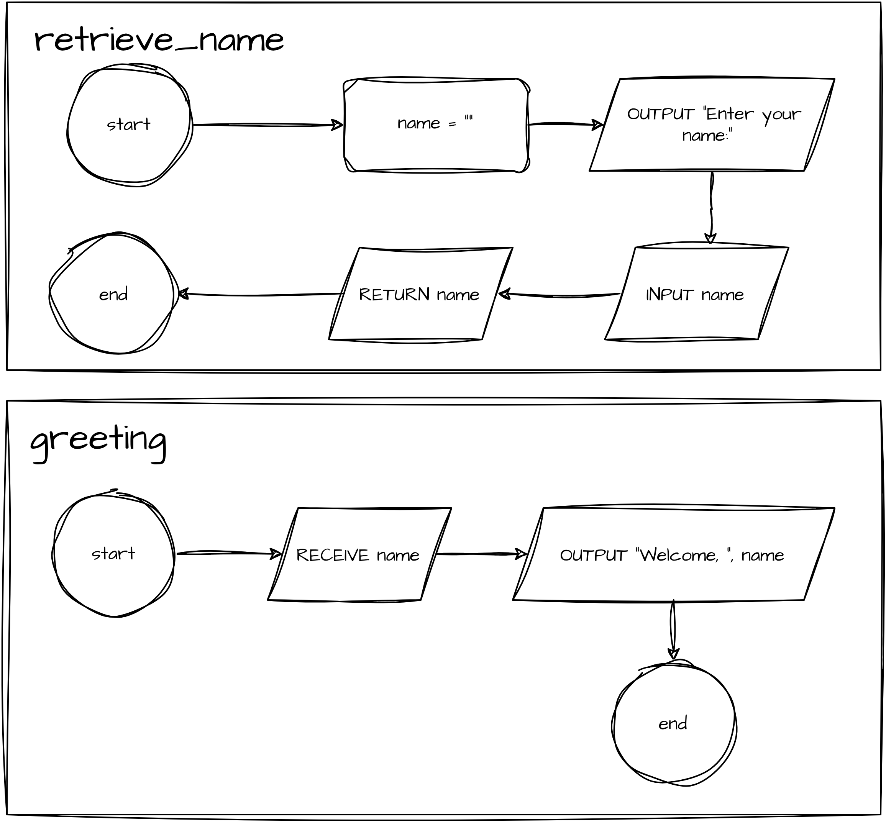

# Debugging Warm-Up 05

Prompts the user to enter their name, then displays a friendly welcome message!

## Files

```
dw05
├── app
│   └── main.cpp
├── CMakeLists.txt
├── imgs
│   └── flowchart.png
├── include
│   └── greeting.h
├── README.md
└── src
    └── greeting.cpp
```

## Compiling and Testing

Generate the project build system (only needs to be done once for the project):

```
cmake -B build -S .
```

Build the project (done whenever there is a change to any of the files):

```
cmake --build build
```

## Flow Chart



## Pseudocode

```
FUNCTION retrieve_name() RETURNS STRING
    DECLARE name : STRING
    OUTPUT "Enter your name:"
    INPUT name
    RETURN name
ENDFUNCTION

FUNCTION greeting(name: STRING) RETURNS VOID
    OUTPUT "Welcome, ", name
ENDFUNCTION
```

